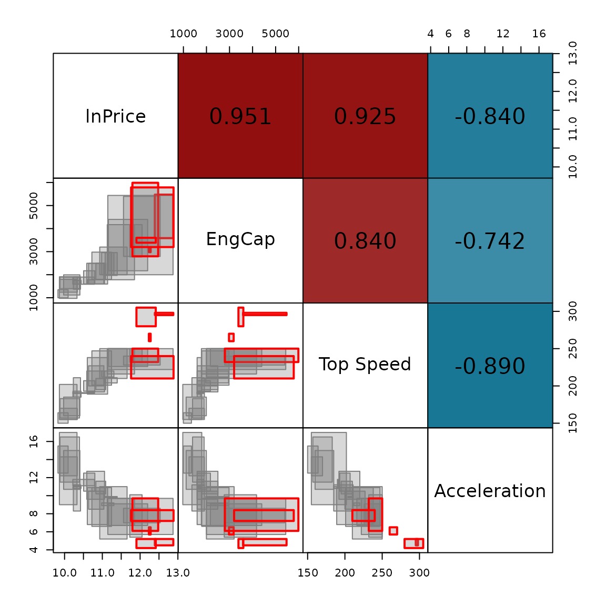
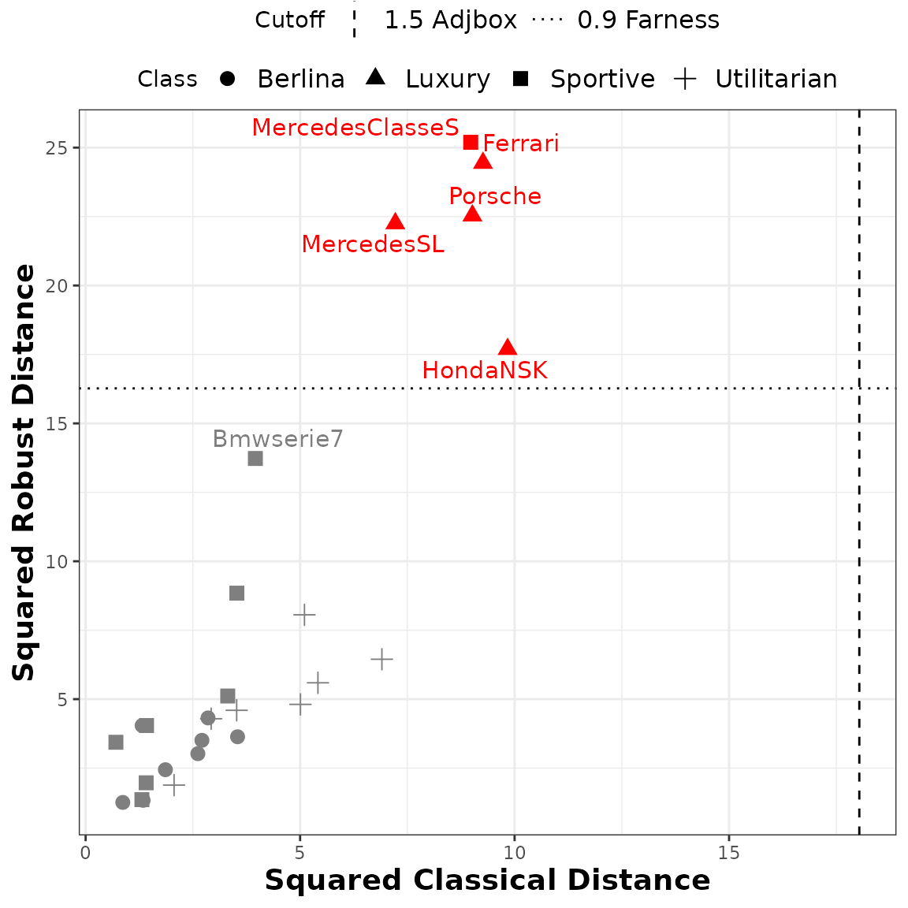
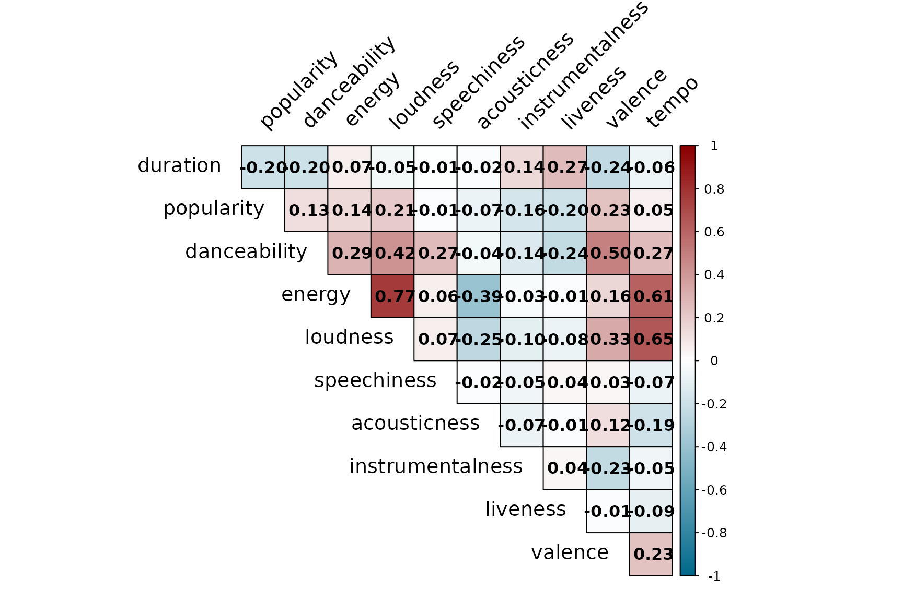
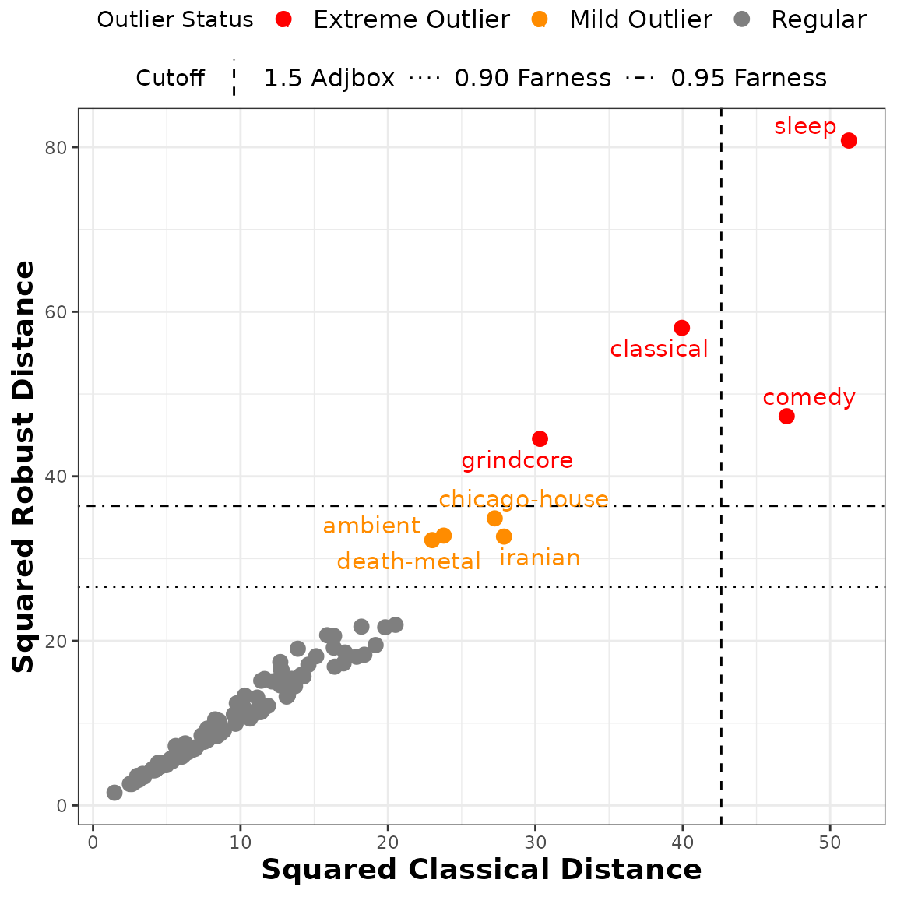

# IMCD estimator examples

``` r

library(AIDA)
```

This vignette reproduces the examples presented in Loureiro et al.
([2026](#ref-loureiro2026)). The real-life examples included here are
the [*Cars*](#cars) and [*Spotify Tracks*](#spotify) datasets, which are
discussed in Sections 6.1 and 6.2 of the paper, respectively. The
datasets are available in the package and can be loaded using
`data("intCars")` and `data("spotify_tracks")`.

The `intData` class is used to create objects that represent
interval-valued data. The `IMCD` function computes the reweighted IMCD
estimates, which are robust estimates of location and scatter for
interval-valued data. The function allows for different cutoff methods
and levels for a one-step reweighting process. The function
`int_outliers` identifies potential outliers in interval-valued data
using robust distance-based methods with customizable cutoff criteria.
The examples provided here demonstrate how to apply these methods to
real datasets, and the results can be compared to those presented in the
paper for validation.

For more details and examples on the `intData` class, please see the
vignette: [*Class `intData`
examples*](https://catarinaploureiro.github.io/AIDA/articles/intData_examples.md).

## Cars Dataset

This dataset contains interval data of car specifications (Duarte Silva
and Brito ([2025](#ref-MAINT.Data))), including min-max values. The
aggregation of the microdata was done by car model, resulting in
$`n=27`$ observations. It is composed of $`5`$ variables:

- Engine Capacity (*EngCap*)
- *Top Speed*
- *Acceleration*
- Price (*lnPrice* after log transformation)
- *Class* (values: *Berlina*, *Luxury*, *Sportive*, and *Utilitarian*)

As no microdata are available, and following the standard assumption in
the literature, we adopt a continuous uniform distribution for the
latent variables, corresponding to the symmetric and i.d. case with
$`\delta = 1/12`$. This is the default setting for the `intData` class.

``` r

data(intCars)
cars_microdata <- intCars$microdata
cars_int <- intCars$intData
```

The `IMCD` function is used to compute the reweighted IMCD estimates and
the robust squared Interval-Mahalanobis distances of each observation
from the estimated barycenter. The subset size is set to
$`\lfloor 0.75\times 27\rfloor=20`$, and the reweighting cutoff to
“farness” with a cutoff level of $`0.9`$. The `int_outliers` function
identifies potential outliers based on the robust distances obtained
from the IMCD estimates, using the same cutoff criteria.

``` r

cars_IMCD <- IMCD(cars_int, m = floor(0.75*cars_int@NObs), cutoff = "farness", cutoff_lvl = 0.9)
cars_outliers <- int_outliers(cars_IMCD$robust_dist, cutoff = "farness", cutoff_lvl = 0.9)
cars_outliers$outliers_names
#> [1] "Ferrari"         "HondaNSK"        "MercedesSL"      "MercedesClasseS"
#> [5] "Porsche"
```

Pairs plot, the lower triangular shows scatter plots of the four
variables, with the outlying observations highlighted in red, while the
upper triangular shows the interval correlation matrix.

``` r

cars_outliers_colors <- rep('gray50', cars_int@NObs)
names(cars_outliers_colors) <- rownames(cars_int)
cars_outliers_colors[cars_outliers$outliers_names] <- 'red'

SYMB.pairs.panels(cars_int, palette = cars_outliers_colors, type = "rectangles", 
                    corr = cov2cor(cars_IMCD$cov_IMCD), labels = colnames(cars_int),
                    is_outlier = cars_outliers$is_outlier, gap = 0)
```



Distance-distance plot of the classical versus robust squared
Interval-Mahalanobis distances. The points’ shape represents the car
model class, the horizontal and vertical lines correspond to the 0.9
farness cutoff value and the 1.5 adjusted boxplot cutoff value,
respectively, with the outliers marked in red.

``` r

# Classical distances and outliers
cars_class_dist <- IMah_dist(cars_int, z = rep(1,cars_int@NObs))
cars_class_outliers <- int_outliers(cars_class_dist, cutoff = "adjbox", cutoff_lvl = 1.5)

cars_is_outliers <- as.character(cars_outliers$is_outlier)
cars_is_outliers[cars_outliers$is_outlier] <- "Outlier"
cars_is_outliers[!cars_outliers$is_outlier] <- "Inlier"

plot_dist_dist(cars_class_dist, cars_class_outliers$cutoff_value[[2]], class_cutoff_label = "1.5 Adjbox",
                cars_IMCD$robust_dist, cars_outliers$cutoff_value, rob_cutoff_label = "0.9 Farness",
                color_class = cars_is_outliers, ggplotly = FALSE, shape_class = cars_microdata$class, 
                shape_label = "Class", palette = c("gray50","red"), 
                label_obs = c(cars_outliers$outliers_names, "Bmwserie7"))
```



## Spotify Tracks Dataset

This dataset contains interval data of Spotify tracks’ audio features
(Pandya ([2022](#ref-kaggle.spotify2022))), including min-max values and
trimmed intervals, as well as the microdata. The aggregation of the
microdata was done by track genre, resulting in $`n=111`$ observations.
It is composed of 11 audio features:

- *duration*
- *danceability*
- *energy*
- *loudness*
- *speechiness*
- *acousticness*
- *instrumentalness*
- *liveness*
- *valence*
- *tempo*
- *popularity*

Prior to aggregation, logarithmic transformations were applied to
*loudness* and *tempo*, *duration_ms* in milliseconds was converted to
*duration* in minutes, and *popularity* was scaled to the range
$`[0,1]`$. The latent variables’ parameters are estimated from the
microdata, using Kernel Density Estimation (KDE) (package `kde1d`).
Here, we will use the data aggregated into trimmed intervals, taking as
lower and upper bounds the $`1\%`$ and $`99\%`$ quantiles, respectively.

``` r

data(spotify_tracks)
spotify_int <- spotify_tracks$intData_trimmed
```

The IMCD estimates are computed using the `IMCD` function with a subset
size of $`\lfloor 0.75\times 111\rfloor=83`$, and a reweighting cutoff
based on “farness” with a cutoff level of $`0.95`$. The `int_outliers`
function applies the outlier detection rule using a “farness” cutoff of
$`0.95`$ to identify strong outliers and $`0.9`$ for mild outliers.

``` r

spotify_IMCD <- IMCD(spotify_int, m = round(0.75*nrow(spotify_int)), 
                      cutoff = "farness", cutoff_lvl = 0.95)

# Strong outliers
spotify_outliers <- int_outliers(spotify_IMCD$robust_dist, cutoff = "farness", cutoff_lvl = 0.95)
spotify_outliers$outliers_names
#> [1] "classical" "comedy"    "grindcore" "sleep"

# Mild outliers
spotify_outliers_2 <- int_outliers(spotify_IMCD$robust_dist, cutoff = "farness", cutoff_lvl = 0.9)
spotify_outliers_2$outliers_names[!spotify_outliers_2$outliers_names%in%spotify_outliers$outliers_names]
#> [1] "ambient"       "chicago-house" "death-metal"   "iranian"
```

Interval correlation matrix plot based on the IMCD estimates.

``` r

# Compute correlation matrix from the robust covariance matrix
spotify_corr <- cov2cor(spotify_IMCD$cov_IMCD)

colfunc <- colorRampPalette(c("deepskyblue4", "white", "red4"))
corrplot::corrplot(
  spotify_corr,
  method = "color",
  type = "upper",
  diag = FALSE,
  col = colfunc(200),
  tl.col = "black",
  tl.srt = 45,
  tl.offset = 1,
  tl.cex = 1.2,
  outline = TRUE,
  addCoef.col = "black",
  number.cex = 1
)
```



Distance-distance plot of the classical versus robust squared
Interval-Mahalanobis distances for the Spotify dataset. The horizontal
lines correspond to the $`0.9`$ and $`0.95`$ farness cutoff values, with
the extreme outliers marked in red and the mild outliers in orange,
while the vertical line represents the $`1.5`$ adjusted boxplot cutoff.

``` r

# Classical distances and outliers
spotify_class_dist <- IMah_dist(spotify_int, z = rep(1,spotify_int@NObs))
spotify_class_outliers <- int_outliers(spotify_class_dist, cutoff = "adjbox")

spotify_is_outliers <- as.character(spotify_outliers$is_outlier)
spotify_is_outliers[!spotify_outliers_2$is_outlier] <- "Regular"
spotify_is_outliers[spotify_outliers_2$is_outlier] <- "Mild Outlier"
spotify_is_outliers[spotify_outliers$is_outlier] <- "Extreme Outlier"
palette_outliers <- c(
  "Regular"         = "gray50",
  "Mild Outlier"    = "darkorange",
  "Extreme Outlier" = "red"
)

plot_dist_dist(spotify_class_dist, spotify_class_outliers$cutoff_value[[2]], 
                "1.5 Adjbox", spotify_IMCD$robust_dist, 
                c(spotify_outliers_2$cutoff_value, spotify_outliers$cutoff_value), 
                c("0.90 Farness", "0.95 Farness"), color_class = spotify_is_outliers, 
                color_label = "Outlier Status", palette = palette_outliers, ggplotly = FALSE, 
                label_obs = spotify_outliers_2$outliers_names)
```



## References

Duarte Silva, Pedro, and Paula Brito. 2025. *MAINT.Data: Model and
Analyse Interval Data*.
<https://doi.org/10.32614/CRAN.package.MAINT.Data>.

Loureiro, Catarina P., M. Rosário Oliveira, Paula Brito, and Lina
Oliveira. 2026. *Minimum Covariance Determinant Estimator and Outlier
Detection for Interval-valued Data*. <https://arxiv.org/abs/2604.26769>.

Pandya, Maharshi. 2022. *Spotify Tracks Dataset*.
<https://doi.org/10.34740/KAGGLE/DSV/4372070>.
