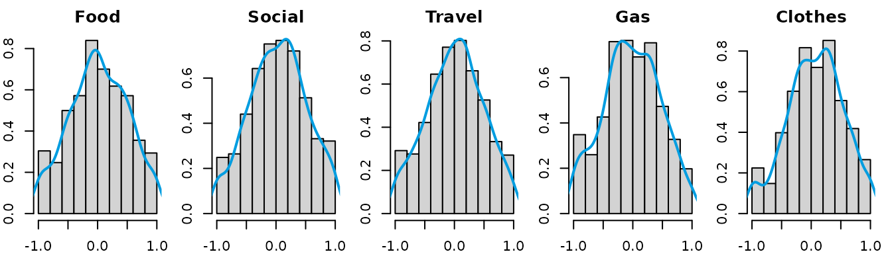
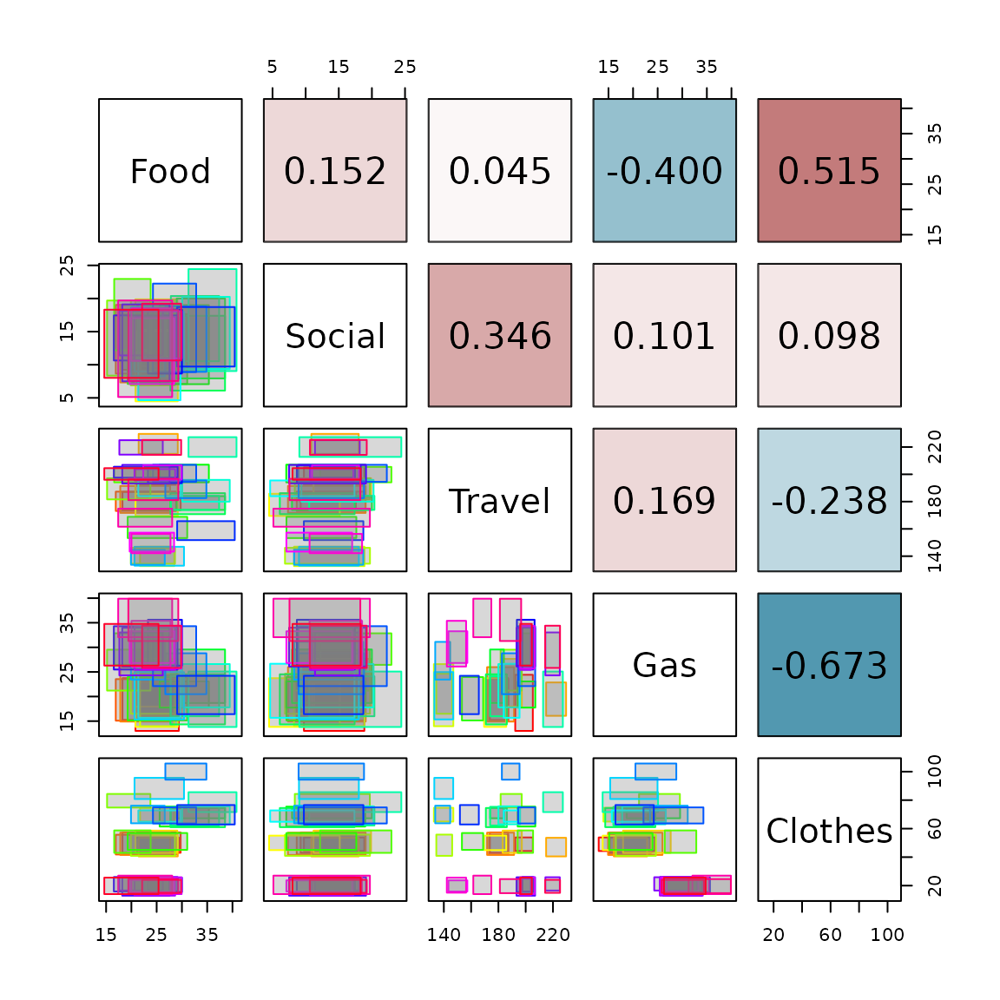

# Class \`intData\` examples

``` r

library(AIDA)
```

This vignette provides examples of how to use the `intData` class and
related functions for handling interval-valued data. The `intData` class
is designed to represent interval-valued data. The examples included
here demonstrate how to create `intData` objects, compute summary
statistics, and visualize interval-valued data using the
`SYMB.pairs.panels` function. The dataset used in these examples is the
*Credit Card* dataset, which is available in the package and can be
loaded using `data("creditcard")`. The examples illustrate the basic
functionalities of the `intData` class and how to work with
interval-valued data in R.

For more details on the interval-valued data framework implemented in
the package, please refer to Oliveira et al.
([2025](#ref-oliveira2025)).

## Credit Card Dataset

This dataset contains interval data of credit card expenses (Billard and
Diday ([2006](#ref-billard_diday_2006))), including min-max values,
centers and ranges, centers and logranges, and microdata. The
aggregation of the microdata was done by person-month, resulting in
$`n=36`$ observations. It is composed of $`5`$ variables:

- *Food*
- *Social*
- *Travel*
- *Gas*
- *Clothes*

The `creditcard` dataset includes the following components:

- `microdata`: A data frame with $`1000`$ rows and $`7`$ columns. It
  contains the microdata, with individual measurements of each variable
  for all observations.
- `min_max`: A data frame with $`36`$ rows and $`10`$ columns. Each row
  corresponds to a different interval observation, and each column gives
  the minimum and maximum values for each variable.
- `centers_ranges`: A data frame with $`36`$ rows and $`10`$ columns.
  Each row corresponds to the centers and ranges of the interval data.
- `centers_logranges`: A data frame with $`36`$ rows and $`10`$ columns.
  Each row corresponds to the centers and logranges of the interval
  data.

``` r

data(creditcard)
CreditCard_microdata <- creditcard$microdata
CreditCard_min_max <- creditcard$min_max
CreditCard_CR <- creditcard$centers_ranges
```

There are different ways to create an `intData` object from the dataset,
depending on the assumptions about the latent distribution of the
microdata. In this example, we will create an `intData` object using the
`min_max` component of the dataset, assuming a continuous uniform
distribution for the latent variables, which corresponds to the
symmetric and i.d. case with $`\delta = 1/12`$. This is the default
setting for the `intData` class.

``` r

credit_card_int_unif <- intData(CreditCard_min_max, Seq = "LbUb_VarbyVar", 
                                VarNames = colnames(CreditCard_microdata)[3:7])

# Check the parameters of the latent distribution                          
credit_card_int_unif@LatentParam
#> [[1]]
#> [1] 0.08333333
```

Since the microdata are available, we can take a closer look at the
distribution of the latent variables. The `get_latent_var` function can
be used to obtain the latent variables observed values, by standardizing
the microdata into the $`[-1,1]`$ interval. In this example, we will use
the `min_max` component of the dataset to standardize the microdata. The
aggregation criterion is by month and name, so we will create a new
variable that combines the name and month to use as the grouping
variable for the standardization process. We can then visualize the
distribution of the latent variables using histograms and density plots.

``` r

credit_agrby <- factor(paste(CreditCard_microdata$Name,CreditCard_microdata$Month, sep = "_"))
credit_card_U <- get_latent_var(CreditCard_microdata[,3:7], CreditCard_min_max, credit_agrby,
                                rownames(CreditCard_min_max), Seq = "LbUb_VarbyVar")

par(mfrow=c(1,5), mar=c(2, 2, 2, 1))
for (i in 1:5){
    hist(credit_card_U[,i], xlab = NULL, ylab = NULL, 
            main = colnames(credit_card_U)[i], probability = TRUE)
    lines(density(credit_card_U[,i], na.rm = TRUE), col = '#009de0', lwd = 2)
}
```



After examining the distribution of the latent variables, we can assume
the distributions are approximately triangular and symmetric. Then, we
can create an `intData` object using the `min_max` component of the
dataset, specifying the latent distribution as “Triang”.

``` r

credit_card_int_triang <- intData(CreditCard_min_max, Seq = "LbUb_VarbyVar", LatentDist = "Triang", 
                                    VarNames = colnames(CreditCard_microdata)[3:7])

# Check the parameters of the latent distribution
credit_card_int_triang@LatentParam
#> [[1]]
#> [1] 0.04166667

head(credit_card_int_triang)
#>                Food                Social                Travel                   Gas               Clothes
#> 1_1   [ 20.81  ,  29.38  ]  [  9.74  ,  18.86  ]  [ 192.33 ,  205.23 ]  [ 13.01  ,  24.42  ]  [ 44.28  ,  53.82  ]  
#> 1_2   [ 21.44  ,  29.18  ]  [ 10.86  ,  18.01  ]  [ 214.98 ,  229.63 ]  [ 16.08  ,  22.86  ]  [ 40.51  ,  53.57  ]  
#> 1_3   [ 20.78  ,  29.09  ]  [ 11.19  ,  19.87  ]  [ 183.12 ,  197.17 ]  [ 17.96  ,  27.65  ]  [ 42.97  ,  58.62  ]  
#> 1_4   [ 20.82  ,  29.18  ]  [  4.48  ,  15.15  ]  [ 169.49 ,  185.75 ]  [ 13.83  ,  23.73  ]  [ 44.93  ,  55.08  ]  
#> 1_5   [ 21.72  ,  28.48  ]  [  8.24  ,  18.88  ]  [ 132.71 ,  146.96 ]  [ 13.97  ,  26.59  ]  [ 64.96  ,  74.60  ]  
#> 1_6   [ 19.90  ,  28.63  ]  [  6.88  ,  19.71  ]  [ 134.48 ,  146.11 ]  [ 16.50  ,  24.64  ]  [ 40.91  ,  55.80  ]
```

The `intData` object contains the centers and ranges of the interval
data, as well as the parameters of the latent distribution. The centers
and ranges can be accessed using the `@Centers` and `@Ranges` slots,
respectively, while the lower and upper bounds can be obtained using the
`LowerBounds` and `UpperBounds` functions.

``` r

credit_card_int_triang@Centers[1:5,]
#>     Food.Centers Social.Centers Travel.Centers Gas.Centers Clothes.Centers
#> 1_1       25.095         14.300        198.780      18.715          49.050
#> 1_2       25.310         14.435        222.305      19.470          47.040
#> 1_3       24.935         15.530        190.145      22.805          50.795
#> 1_4       25.000          9.815        177.620      18.780          50.005
#> 1_5       25.100         13.560        139.835      20.280          69.780
credit_card_int_triang@Ranges[1:5,]
#>     Food.Ranges Social.Ranges Travel.Ranges Gas.Ranges Clothes.Ranges
#> 1_1        8.57          9.12         12.90      11.41           9.54
#> 1_2        7.74          7.15         14.65       6.78          13.06
#> 1_3        8.31          8.68         14.05       9.69          15.65
#> 1_4        8.36         10.67         16.26       9.90          10.15
#> 1_5        6.76         10.64         14.25      12.62           9.64
LowerBounds(credit_card_int_triang)[1:5,]
#>     Food.Lbnd Social.Lbnd Travel.Lbnd Gas.Lbnd Clothes.Lbnd
#> 1_1     20.81        9.74      192.33    13.01        44.28
#> 1_2     21.44       10.86      214.98    16.08        40.51
#> 1_3     20.78       11.19      183.12    17.96        42.97
#> 1_4     20.82        4.48      169.49    13.83        44.93
#> 1_5     21.72        8.24      132.71    13.97        64.96
UpperBounds(credit_card_int_triang)[1:5,]
#>     Food.Ubnd Social.Ubnd Travel.Ubnd Gas.Ubnd Clothes.Ubnd
#> 1_1     29.38       18.86      205.23    24.42        53.82
#> 1_2     29.18       18.01      229.63    22.86        53.57
#> 1_3     29.09       19.87      197.17    27.65        58.62
#> 1_4     29.18       15.15      185.75    23.73        55.08
#> 1_5     28.48       18.88      146.96    26.59        74.60
```

Alternatively, we can create an `intData` object using the
`centers_ranges` component of the dataset, which contains the centers
and ranges of the interval data. As for the latent variables’
parameters, since we have the microdata available, another option is to
estimate the parameters directly based on the microdata by setting
`LatentCase = "General"` and `LatentDist = "KDE"` to use a kernel
density estimation for the latent distribution. In this case, it is
necessary to specify the `Umicro` argument, which contains the
standardized microdata values.

``` r

credit_card_int_KDE <- intData(CreditCard_CR, Seq = "LbUb_VarbyVar", 
                                VarNames = colnames(CreditCard_microdata)[3:7], 
                                LatentCase = "General", LatentDist = "KDE", Umicro = credit_card_U)

# Check the parameters of the latent distribution
credit_card_int_KDE@LatentParam
#> [[1]]
#>           [,1]      [,2]      [,3]      [,4]      [,5]
#> [1,] 0.2385710 0.2266593 0.2234636 0.2237180 0.2198639
#> [2,] 0.2266593 0.2336648 0.2210776 0.2208769 0.2183596
#> [3,] 0.2234636 0.2210776 0.2277094 0.2183420 0.2143626
#> [4,] 0.2237180 0.2208769 0.2183420 0.2293551 0.2129321
#> [5,] 0.2198639 0.2183596 0.2143626 0.2129321 0.2220598
#> 
#> [[2]]
#>            [,1]      [,2]      [,3]        [,4]       [,5]
#> [1,] 0.01970377 0.0000000 0.0000000  0.00000000 0.00000000
#> [2,] 0.00000000 0.0353448 0.0000000  0.00000000 0.00000000
#> [3,] 0.00000000 0.0000000 0.0151136  0.00000000 0.00000000
#> [4,] 0.00000000 0.0000000 0.0000000 -0.01665365 0.00000000
#> [5,] 0.00000000 0.0000000 0.0000000  0.00000000 0.07370565
```

In the majority of the cases, the macrodata has to be constructed from
the microdata. The `micro2intData` function can be used to create an
`intData` object from the microdata, by aggregating the microdata
according to a specified criterion. In this example, we will aggregate
the microdata by month and name, using the same grouping variable
created earlier. We will also specify the latent distribution as
“General” to estimate the parameters based on the microdata. If the
`LatentCase` argument is omitted, it assumes the latent distribution is
uniform (i.d. and symmetric), which is the default setting for the
`intData` class. It is also possible to specify the latent distribution,
as seen in the previous examples.

``` r

credit_card_int_agr <- micro2intData(CreditCard_microdata[,3:7], credit_agrby, LatentCase = "General")

# Check the parameters of the latent distribution
credit_card_int_agr@LatentParam
#> [[1]]
#>           [,1]      [,2]      [,3]      [,4]      [,5]
#> [1,] 0.2385710 0.2266593 0.2234636 0.2237180 0.2198639
#> [2,] 0.2266593 0.2336648 0.2210776 0.2208769 0.2183596
#> [3,] 0.2234636 0.2210776 0.2277094 0.2183420 0.2143626
#> [4,] 0.2237180 0.2208769 0.2183420 0.2293551 0.2129321
#> [5,] 0.2198639 0.2183596 0.2143626 0.2129321 0.2220598
#> 
#> [[2]]
#>            [,1]      [,2]      [,3]        [,4]       [,5]
#> [1,] 0.01970377 0.0000000 0.0000000  0.00000000 0.00000000
#> [2,] 0.00000000 0.0353448 0.0000000  0.00000000 0.00000000
#> [3,] 0.00000000 0.0000000 0.0151136  0.00000000 0.00000000
#> [4,] 0.00000000 0.0000000 0.0000000 -0.01665365 0.00000000
#> [5,] 0.00000000 0.0000000 0.0000000  0.00000000 0.07370565

head(credit_card_int_agr)
#>                 Food                Social                Travel                   Gas               Clothes
#> 1_1    [ 20.81  ,  29.38  ]  [  9.74  ,  18.86  ]  [ 192.33 ,  205.23 ]  [ 13.01  ,  24.42  ]  [ 44.28  ,  53.82  ]  
#> 1_10   [ 18.24  ,  29.75  ]  [  9.24  ,  17.57  ]  [ 173.76 ,  187.12 ]  [ 15.25  ,  23.75  ]  [ 43.05  ,  57.34  ]  
#> 1_11   [ 16.91  ,  28.85  ]  [  8.65  ,  19.03  ]  [ 173.12 ,  187.30 ]  [ 15.09  ,  23.54  ]  [ 41.85  ,  55.70  ]  
#> 1_12   [ 17.80  ,  27.67  ]  [  7.33  ,  19.06  ]  [ 171.71 ,  191.47 ]  [ 14.91  ,  25.97  ]  [ 41.54  ,  57.18  ]  
#> 1_2    [ 21.44  ,  29.18  ]  [ 10.86  ,  18.01  ]  [ 214.98 ,  229.63 ]  [ 16.08  ,  22.86  ]  [ 40.51  ,  53.57  ]  
#> 1_3    [ 20.78  ,  29.09  ]  [ 11.19  ,  19.87  ]  [ 183.12 ,  197.17 ]  [ 17.96  ,  27.65  ]  [ 42.97  ,  58.62  ]
```

Now that we have created the `intData` object, we can, for instance,
compute the symbolic covariance and correlation matrices of the interval
data using the `int_cov` function.

``` r

credit_card_cov <- int_cov(credit_card_int_agr)
credit_card_cor <- cov2cor(credit_card_cov)

# Check the covariance matrix
credit_card_cov
#>              Food     Social      Travel         Gas     Clothes
#> Food    19.311563  1.0362555    4.753931  -9.3001616   54.408201
#> Social   1.036255  2.3969207   12.755943   0.8241657    3.661854
#> Travel   4.753931 12.7559432  567.525646  21.2722637 -136.381036
#> Gas     -9.300162  0.8241657   21.272264  28.0447659  -85.604729
#> Clothes 54.408201  3.6618540 -136.381036 -85.6047285  576.922703
```

Finally, we can visualize the interval data using the
`SYMB.pairs.panels` function, which creates a pairs plot for
interval-valued data. The lower triangular shows scatter plots of the
variables, while the upper triangular shows the interval correlation
matrix.

``` r

SYMB.pairs.panels(credit_card_int_agr, type = "rectangles", 
                    corr = credit_card_cor, labels = colnames(credit_card_int_agr))
```



## References

Billard, Lynne, and Edwin Diday. 2006. *Symbolic Data Analysis:
Conceptual Statistics and Data Mining*. John Wiley & Sons.
<https://doi.org/10.1002/9780470090183>.

Oliveira, M. Rosário, Diogo Pinheiro, and Lina Oliveira. 2025. *Location
and association measures for interval data based on Mallows’ distance*.
<https://arxiv.org/abs/2407.05105>.
